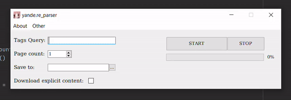
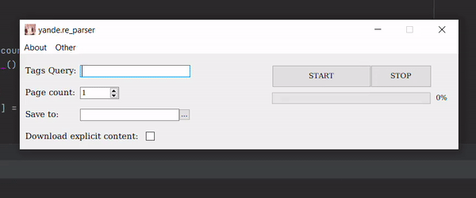

# yande.re_parser
It`s a parser for yande.re with GUI.

# Installation
For successful installation and operation of the program you need to install dependencies.\
`pip install -r requirements.txt`\
Then you can run the program with this command in the root path.\
`python app.py`\
\
You can also use executable exe file from releases

# How to use
To use the program, just enter the tags in the tag line, select the number of pages and the folder to save\
\

# Advanced settings
The program also has advanced settings - the number of processes and image format.\
You can open these settings using the Other button in the menu bar.\
The default value of the number of processes is the most effective for your pc (since it equals the number of processor threads).\
Changing the image format can affect download speed, image quality and weight.\
\

